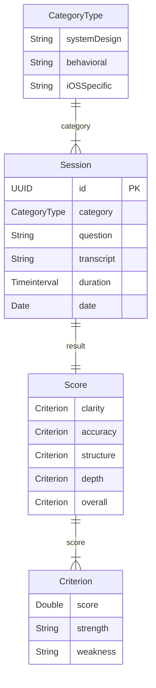

# PrepAI data models

```mermaid
erDiagram
    Session {
        UUID id PK
        CategoryType category
        String question
        String transcript
        Timeinterval duration
        Date date
    }

    Score {
        Criterion clarity
        Criterion accuracy
        Criterion structure
        Criterion depth
        Criterion overall
    }

    Criterion {
        Double score
        String strength
        String weakness
    }

    CategoryType {
        String systemDesign
        String behavioral
        String iOSSpecific
    }

    Session ||--|| Score : "result"
    Score ||--|{ Criterion : "score"
    CategoryType ||--|{ Session : "category"
```